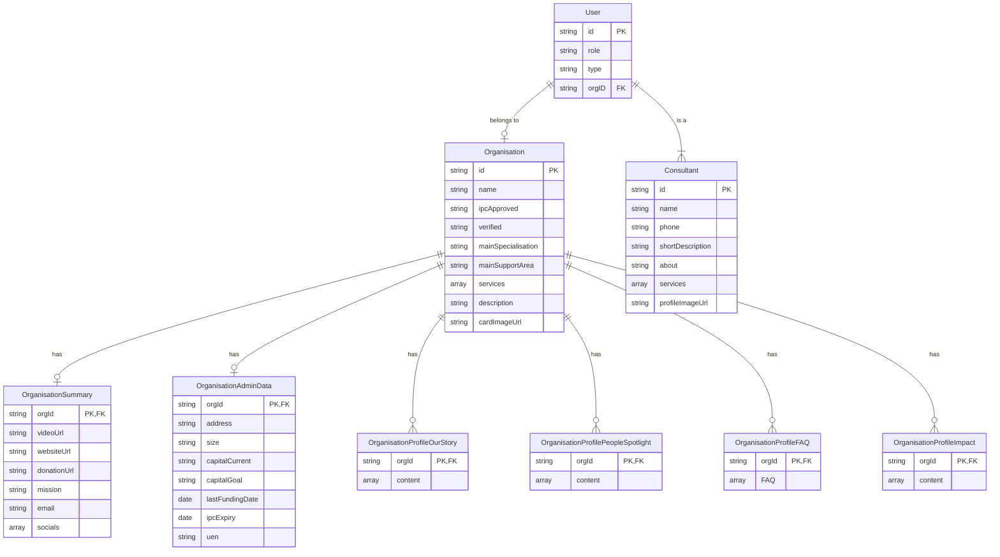

# Data Model

The application uses Firebase Firestore with the following data structure:

## Relationships

- **User** → **Organisation**: Each user may belong to one organisation via `orgID`
- **Organisation** → **OrganisationSummary**: One-to-one relationship for contact and social information
- **Organisation** → **OrganisationAdminData**: One-to-one relationship for administrative data
- **Organisation** → **Profile Collections**: One-to-many relationships with:
  - **OrganisationProfileOurStory**: Organisation's story content
  - **OrganisationProfilePeopleSpotlight**: Featured people
  - **OrganisationProfileFAQ**: Frequently asked questions
  - **OrganisationProfileImpact**: Impact stories

## User Types

The `users` collection contains different types of users, distinguished by the `type` field:

- **Organisation Users**: Users associated with an organisation (type: `organisationUser`)
  - Have `orgID`, `role`, and `type` fields
  - Linked to an organisation via `orgID`

- **Consultants**: Independent consultant users (type: `consultant`)
  - Have all base user fields plus additional consultant-specific fields:
    - `name`: Consultant's full name
    - `phone`: Contact phone number
    - `shortDescription`: Brief professional summary
    - `about`: Detailed biography
    - `services`: Array of consulting services offered
    - `profileImageUrl`: URL to profile photo stored in Firebase Storage
  - May optionally be associated with an organisation via `orgID`

## Firestore Collections

### Main Collections
- `organisations` - Core organisation data
- `users` - All user data including consultants and organisation users

### Organisation Subcollections
Each organisation document has the following subcollections:
- `organisationSummary` - Contact and social information
- `organisationAdminData` - Administrative details
- `organisationOurStory` - Story content
- `organisationPeopleSpotlight` - People features
- `organisationFAQ` - FAQ content
- `organisationImpact` - Impact stories
