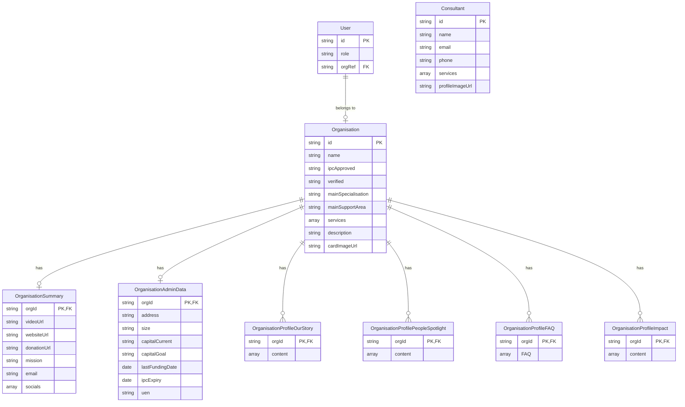

# Data Model

The application uses Firebase Firestore with the following data structure:

## Relationships

- **User** → **Organisation**: Each user belongs to one organisation via `orgRef`
- **Organisation** → **OrganisationSummary**: One-to-one relationship for contact and social information
- **Organisation** → **OrganisationAdminData**: One-to-one relationship for administrative data
- **Organisation** → **Profile Collections**: One-to-many relationships with:
  - **OrganisationProfileOurStory**: Organisation's story content
  - **OrganisationProfilePeopleSpotlight**: Featured people
  - **OrganisationProfileFAQ**: Frequently asked questions
  - **OrganisationProfileImpact**: Impact stories
- **Consultant**: Independent entity (no direct relationship to Organisation)

## Firestore Collections

### Main Collections
- `organisations` - Core organisation data
- `users` - User role data
- `consultants` - Consultant profile data

### Organisation Subcollections
Each organisation document has the following subcollections:
- `organisationSummary` - Contact and social information
- `organisationAdminData` - Administrative details
- `organisationOurStory` - Story content
- `organisationPeopleSpotlight` - People features
- `organisationFAQ` - FAQ content
- `organisationImpact` - Impact stories
